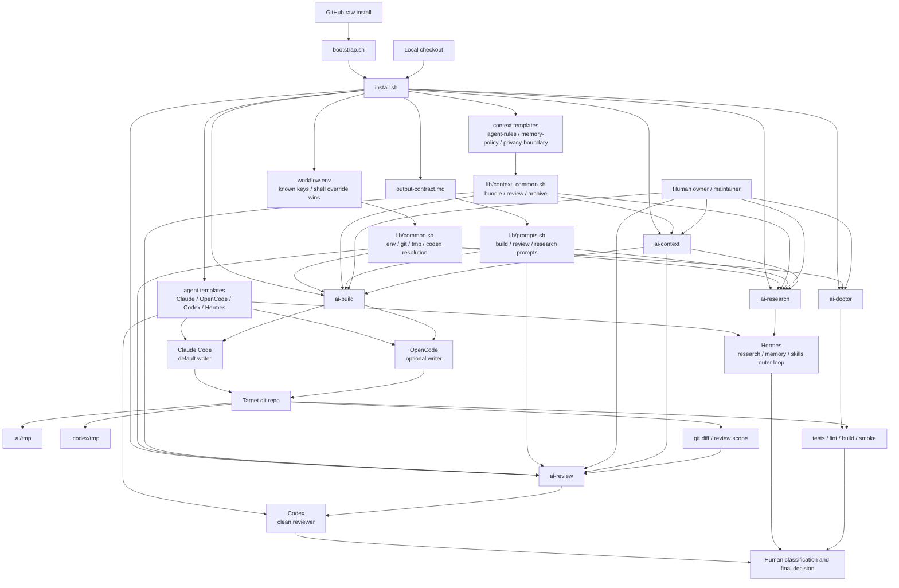
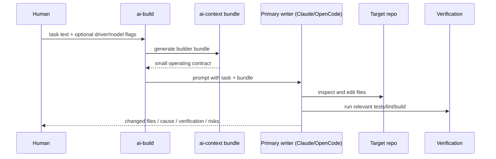
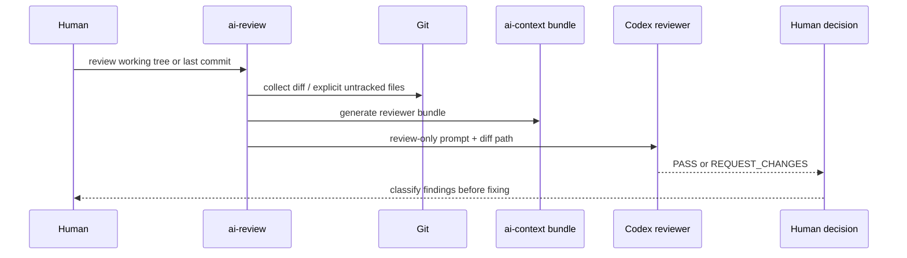
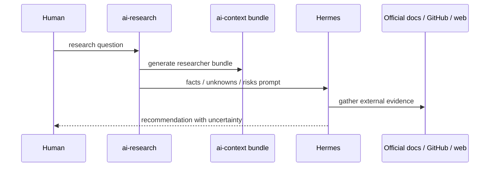

# agent-workflow-bootstrap architecture

Last updated: 2026-05-03 CST

Editable visual diagram: `docs/architecture.excalidraw`

## 1. Architecture summary

agent-workflow-bootstrap is a thin shell distribution around existing AI coding tools.

The system has five layers:

1. Distribution and install
2. Global workflow contracts
3. Runtime wrapper commands
4. Agent role execution
5. Repository boundary and verification

The critical design is not “many agents do everything”. The critical design is:

```text
one primary writer + one clean reviewer + one research outer loop + one context boundary
```

## 2. Full system diagram



## 3. Install-time architecture

Install can start from either a local checkout or a raw GitHub script.

```text
local checkout
  -> ./install.sh
  -> copy templates / env defaults
  -> link wrappers into ~/.local/bin
  -> optionally patch Hermes skills path

raw GitHub install
  -> install.sh or bootstrap.sh
  -> download tarball
  -> stage repo under ~/.local/share/agent-workflow-bootstrap
  -> re-exec staged install.sh
  -> link wrappers to stable staged repo
```

Important invariants:

- install is idempotent
- existing user files are skipped by default
- `--force` is required to overwrite
- wrapper symlinks should not clobber unrelated user commands
- direct install must not leave wrappers pointing into a temporary directory
- required-file guard must include every file the installer needs

## 4. Runtime command architecture

### `ai-context`

Purpose: context boundary, not memory storage.

Responsibilities:

- install editable context templates
- generate target-specific bundles
- review context files for size and obvious secret-looking text
- archive generated bundles

Inputs:

- `~/.config/agent-stack/context/agent-rules.md`
- `~/.config/agent-stack/context/memory-policy.md`
- `~/.config/agent-stack/context/privacy-boundary.md`
- `AI_CONTEXT_*` env settings

Outputs:

- stdout bundle, explicit output path, or files under configured bundle directory

Never owns:

- real personal memory
- raw chat logs
- full vaults
- company source or secrets

### `ai-build`

Purpose: one selected primary writer implements and verifies.

Default path:

```text
ai-build
  -> load workflow.env defaults with shell override precedence
  -> ensure git repo and tmp dirs
  -> generate builder context bundle
  -> build prompt
  -> call Claude Code by default
```

Alternate path:

```text
AGENT_BUILD_DRIVER=opencode ai-build ...
  -> call OpenCode as selected primary writer
```

Hard rule:

- only the selected primary writer writes
- no multi-agent co-writing by default

### `ai-review`

Purpose: clean-context diff review.

Flow:

```text
ai-review
  -> prepare review diff under .codex/tmp
  -> generate reviewer context bundle
  -> build strict review prompt
  -> call Codex in review-only mode
  -> output PASS or REQUEST_CHANGES
```

Review findings are hypotheses. The project does not treat reviewer output as automatic patch instructions.

### `ai-research`

Purpose: external research and engineering decision support.

Flow:

```text
ai-research
  -> generate researcher context bundle
  -> build research prompt
  -> call Hermes with configured profile/toolsets
  -> return facts / unknowns / risks / recommendation
```

No repo mutation should happen from the research step.

### `ai-doctor`

Purpose: explain the effective configuration and fail early.

Checks:

- workflow env path and effective values
- active build driver binary
- inactive driver as informational
- Codex availability
- Hermes availability
- installed templates
- context files
- current repo tmp dirs
- Hermes external skills path when relevant

## 5. Global install targets

```text
~/.config/agent-stack/workflow.env
~/.config/agent-stack/output-contract.md
~/.config/agent-stack/context/
  agent-rules.md
  memory-policy.md
  privacy-boundary.md
  context-bundle.example.md

~/.claude/CLAUDE.md
~/.config/opencode/AGENTS.md
~/.codex/AGENTS.md
~/.agents/skills/repo-review/SKILL.md
~/.agents/skills/repo-brief/SKILL.md
~/.hermes/SOUL.md

~/.local/bin/ai-build
~/.local/bin/ai-context
~/.local/bin/ai-review
~/.local/bin/ai-research
~/.local/bin/ai-doctor
```

Design reason:

- global workflow contracts avoid per-repo config sprawl
- repo-specific files are optional and should be rare
- generated repo-local files stay under temp directories only

## 6. Repository boundary

Inside any target repo, the workflow may create:

```text
.ai/tmp/
.codex/tmp/
```

Default workflow should not create:

```text
code_review.md
opencode.json
many one-off plan documents
root-level prompt dumps
```

The target repo remains the source of truth for code, tests, and project-specific rules.

## 7. Data-flow diagrams

### Build flow



### Review flow



### Research flow



## 8. Responsibility matrix

| Component | Owns | Must not own |
|---|---|---|
| `install.sh` | installation, linking, template copying | tool auth, personal memory, project code |
| `workflow.env` | defaults and command selection | secrets by default, hard override of shell env |
| `lib/common.sh` | env loading, tmp dirs, command resolution | business logic |
| `lib/context_common.sh` | context bundle/review/archive | durable memory store |
| `lib/prompts.sh` | wrapper prompt contracts | long project-specific plans |
| `ai-build` | primary writer invocation | reviewer classification, multi-agent orchestration |
| `ai-review` | diff prep and Codex review invocation | automatic fixes |
| `ai-research` | Hermes research invocation | code mutation |
| `ai-doctor` | environment diagnosis | installation side effects beyond temp dirs |
| `verify/*` | repeatable checks | paid model quality evaluation |

## 9. Security and privacy guardrails

Default guardrails:

- context bundle is small and reviewed
- no secrets in templates
- no real long-term user memory in this repo
- no company source or internal logs in personal context bundles
- no automatic multi-agent write loops
- `--force` is explicit for destructive install overwrites
- reviewer is read-only by contract
- company mode, if added, must fail closed

## 10. Extension points

Allowed future extension points:

- additional build driver behind explicit `AGENT_BUILD_DRIVER=<name>`
- stronger `ai-doctor` smoke checks
- optional company profile templates
- `ai-apply-review` after classification design is proven
- example profiles for common repo types
- optional MCP/profile integration as documented adapters

Extension rules:

1. do not break shell-first install
2. do not add default repo pollution
3. do not add personal memory storage
4. do not make inactive executors noisy blockers
5. do not add parallel writers to the same files by default
6. every new command or profile needs a verification path

## 11. Known gaps

Current known gaps:

- OpenCode provider/model smoke is not yet strong enough for GPT writer recommendations
- `ai-apply-review` is intentionally not implemented
- company workflow is currently guidance, not enforced profile code
- architecture is documented, but release checks still need to prove docs and behavior stay aligned
- shell CLI flag drift remains a permanent maintenance risk

## 12. Design mantra

```text
Keep the system small enough to trust.
Make the safe path the easy path.
One writer writes; clean reviewers review; humans decide.
```
